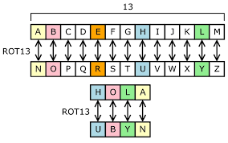
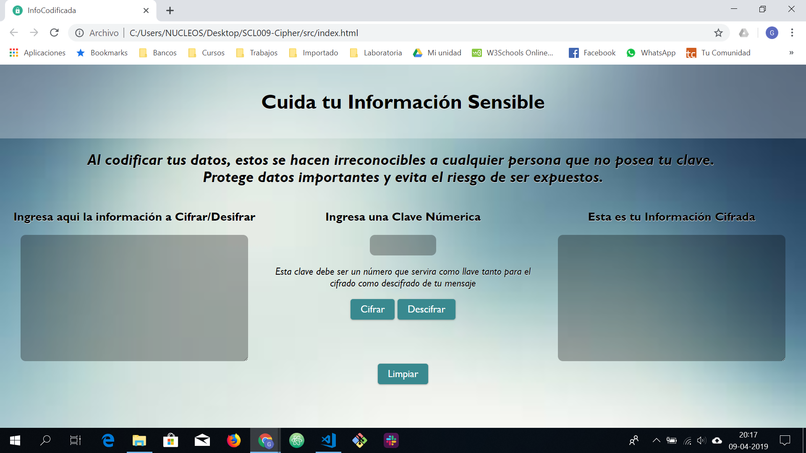

# InfoCodificada
Aplicación para el cifrado de información importante y/o sensible que deba ser protegida. El metodo de cifrado utilizado se denomina:

## Cifrado César

Cifrar significa codificar. El [cifrado César](https://en.wikipedia.org/wiki/Caesar_cipher) es uno de los primeros métodos de cifrado conocidos. El emperador romano Julio César lo usaba para enviar órdenes secretas a sus generales en los campos de batalla.



El cifrado césar es una de las técnicas más simples para cifrar un mensaje. Es un tipo de cifrado por sustitución, es decir que cada letra del texto original es reemplazada por otra que se encuentra un número fijo de posiciones (desplazamiento) más adelante en el mismo alfabeto.

## Definición del producto

Se basa en una aplicación web que servirá para que el usuario pueda cifrar y descifrar un texto mediante una clave (_offset_) definida por el mismo, basada en números positivos. La información a cifrar/descifrar abarca letras mayusculas y minusculas, números; caracteres especiales como espacios, acentuación, signos de puntuación, entre otros seran devueltos en el mismo orden del texto original.

Va dirigido a personal de empresas que intercambian a diario información relevante y sensible por medios no tan seguros como correo u otras aplicaciones de mensajeria que pudieran requerir un mayor nivel de seguridad de la información, personas que manejan datos y/o archivos que deben mantener protegidos antes ataques de seguridad; permitiendo al usuario manejar dicha información con la confianza que genera un encriptado.

Las Pruebas en usuarios mediante prototipos de baja fidelidad condujeron a una interfaz simplista, con instrucciones cortas y contretas, donde el usuario pueda tener lo que transcribe y los resultados del cifrado en una sola vista.

### Interfaz de usuario (UI)

Una interfaz básica y sencilla en una sola pantalla, que aporta:
- Visualización de información cifrada/descifrada a la mano.
- Clave númerica definida por el usuario para mayor identidad con la misma.
- Instrucciones cortas y precisas.
- Facilidad de uso y manipulación por parte del usuario.
- Enfoque en la finalidad de la aplicación, sin distracciones innesarias.


*Imagen de la pantalla*

### Consideraciones Técnicas

La lógica del proyecto esta implementada completamente en JavaScript (ES6)
[(vanilla JavaScript)](https://medium.com/laboratoria-how-to/vanillajs-vs-jquery-31e623bbd46e), HTML 5 y CSS 3.

El _boilerplate_ contiene una estructura de archivos así como toda la configuración de dependencias y tests:

```text
./
├── .editorconfig
├── .eslintrc
├── .gitignore
├── README.md
├── package.json
├── src
│   ├── cipher.js
│   ├── index.html
│   ├── index.js
│   └── style.css
└── test
    ├── cipher.spec.js
    ├── headless.js
    └── index.html
```

## Como Usar
#### Landing Page
Para acceder a la aplicación debes copiar la siguiente dirección en cualquier navegador: GelenMR.github.io/SCL009-Cipher/src/index.html

## Recursos y temas relacionados

Herramientas:
- [GitHub y GitHub Pages](https://guides.github.com/)